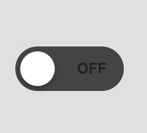

# Toggle Switch

A simple ON / OFF toggle switch built using HTML, CSS and JavaScript.

## Preview

OFF


ON


## How to Run

1. Download or clone the repository
2. Open the project folder
3. Run the file

```
index.html
```

Open it in your browser.

---

⭐ If you like this project, please give this repository a **star**.

