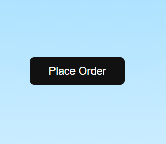
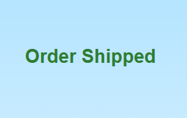

# íºš Delivery Animation (HTML, CSS, JavaScript)

A small **delivery truck animation project** built using **HTML, CSS, and JavaScript**.
When the **Place Order** button is clicked, a truck arrives, packages are loaded, and the order is shipped with a smooth animation.

---

## í³¸ Preview

### í¶¥ï¸� Animation Start



### í³¦ Packages Loading


### íºš Truck Delivering



### ✅ Order Shipped


---

## ✨ Features

* íºš Animated delivery truck
* í³¦ Package loading animation
* �� Moving clouds and background
* í¼³ Animated trees and mountains
* í»£ï¸� Moving road effect
* ✅ Order shipped success message
* í²» Pure **HTML + CSS + JavaScript**
* âš¡ Lightweight and beginner-friendly

---

## í» ï¸� Technologies Used

* HTML5
* CSS3 (Animations & Keyframes)
* JavaScript (DOM manipulation)

---

## í³‚ Project Structure

```
delivery-animation
│
├── index.html
├── README.md
└── images
    ├── start.png
    ├── loading.png
    ├── truck.png
    └── success.png
```

---

## í¾¥ Demo

Click the **Place Order** button and watch the animation:

1. Truck arrives
2. Packages load
3. Truck drives away
4. Order shipped message appears

---

## í³œ License

This project is open-source and free to use for learning and personal projects.

---

â­� If you like this project, consider giving it a **star on GitHub**!

