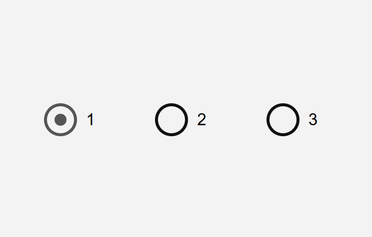
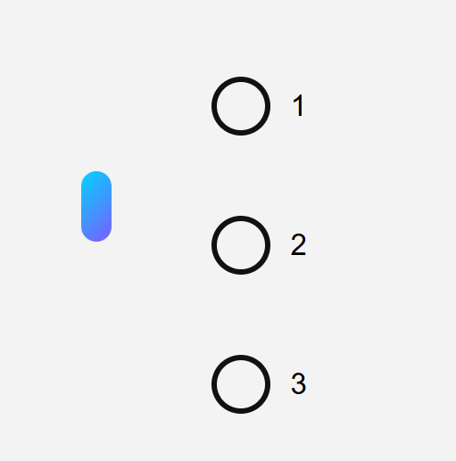

# Liquid Radio Button Animation

A simple and modern radio button interaction built using **HTML, CSS, and JavaScript**.
Instead of switching instantly, the selection moves using a **smooth liquid animation** that travels between the options.

## Preview

<p align="center">
  
  
</p>

The first example shows normal radio buttons.
The second example shows the liquid animation that smoothly moves from one option to another.

## Features

Custom radio buttons
Smooth liquid movement between options
Stretch and jelly effect during animation
Modern gradient styling
Lightweight and simple code
No libraries required

## Technologies Used

HTML
CSS
JavaScript

## How It Works

Each radio button is styled using CSS to create a custom circle.

When a user clicks another option:

The previous button loses its active state
A liquid element appears and travels from the previous button to the new one
The liquid stretches slightly while moving to simulate fluid motion
After reaching the target button the new option becomes active

The movement is created using **JavaScript animation with requestAnimationFrame**.

## Project Structure

```
project-folder
│
├── index.html
├── README.md
└── images
    ├── normal.png
    └── liquid.png
```

## Usage

Add your preview images inside the **images folder** and open the HTML file in a browser to see the animation.

## License

Free to use for learning and personal projects.

