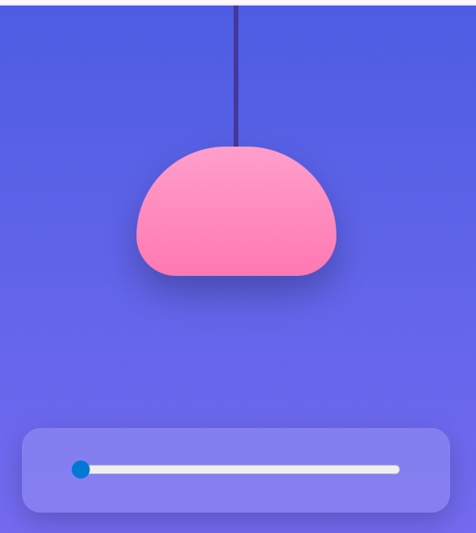
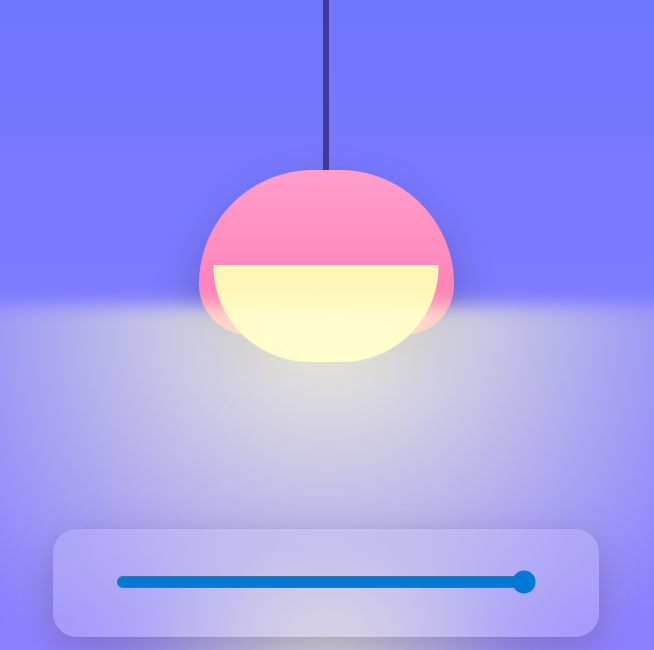

# Realistic Lamp Brightness Animation í²¡

A modern and realistic lamp animation built using **HTML, CSS, and JavaScript**.
Control the brightness of the lamp using a slider and watch how the light intensity, glow, and background change smoothly.

## Preview

<p align="center">
  
  
</p>

The first image shows low brightness.
The second image shows high brightness with full light effect.

## Features

Realistic lamp glow effect
Smooth brightness control using slider
Dynamic light cone and floor reflection
Background brightness changes with intensity
Clean and modern UI design
No external libraries required

## Technologies Used

HTML
CSS
JavaScript

## How It Works

The slider controls the brightness value.

As the value increases:

The lamp glow becomes stronger
The light cone expands and brightens
The floor reflection becomes visible
The background color adjusts for realism

All animations are handled using JavaScript and CSS transitions.

## Project Structure

```id="lamp_struct"
project-folder
│
├── index.html
├── README.md
└── images
    ├── lamp-off.png
    └── lamp-on.png
```


