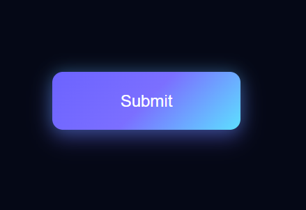
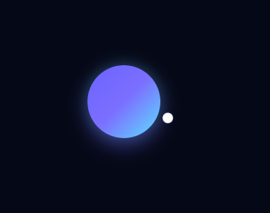

# ✨ Animated Submit Button

A modern and clean **Submit Button Animation** built using **HTML & CSS**.
It shows a smooth transition from **initial state → animation → success state**.

---

## íº€ Features

* í¾¯ Clean and minimal UI
* âš¡ Smooth animation flow
* í´„ Button morph effect
* ✔ Success state feedback
* � Easy to customize

---

## í¶¼ï¸� Preview

<p align="center">
  
  
  
</p>

---

## í» ï¸� Tech Used

* HTML
* CSS

---

## í³‚ Project Structure

```id="struct55"
project-folder/
│── index.html
│── README.md
└── images/
    ├── initial.png
    ├── animation.png
    ├── success.png
```

---

## í³Œ How to Use

1. Download or copy the code
2. Open `index.html` in your browser
3. Customize styles as needed

---

## â­� Final

A smooth and modern button animation that enhances user experience.
Perfect for UI design, projects, and learning purposes íº€


