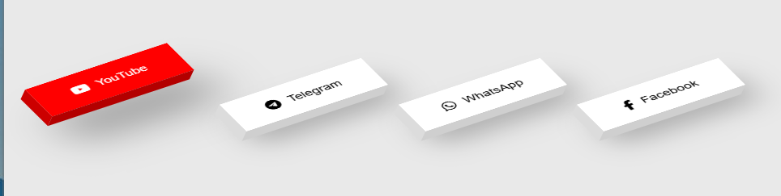
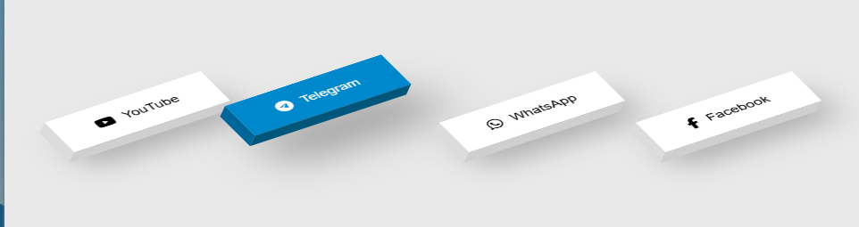
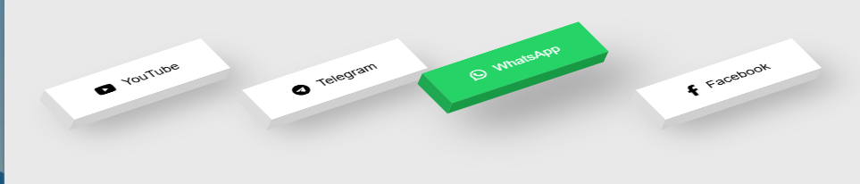
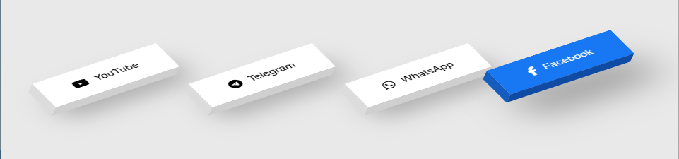

# Ì∫Ä 3D Social Media Buttons Animation

A clean and premium **3D social media button animation** built using **HTML & CSS**.
Each button has a smooth hover effect with realistic 3D depth.

---

## ‚ú® Features

* Smooth 3D hover animation
* Clean and modern UI
* Responsive layout (works on all screens)
* Brand color hover effects
* Lightweight (no JavaScript)

---

## Ì∂ºÔ∏è Preview

  
  

  
  

---

## ̪†Ô∏è Technologies Used

* HTML5
* CSS3 (Transforms, Grid, Shadows)

---

## Ì≥± Platforms Included

* YouTube
* Telegram
* WhatsApp
* Facebook

---

## ÌæØ How It Works

Hover over any button to see:

* 3D lift effect
* Color transition
* Shadow enhancement

---

## Ì≤° Customization

You can easily:

* Change platform links
* Modify colors
* Adjust size and spacing

---

## ⭐ Result

A simple yet premium UI component for modern websites.

---

