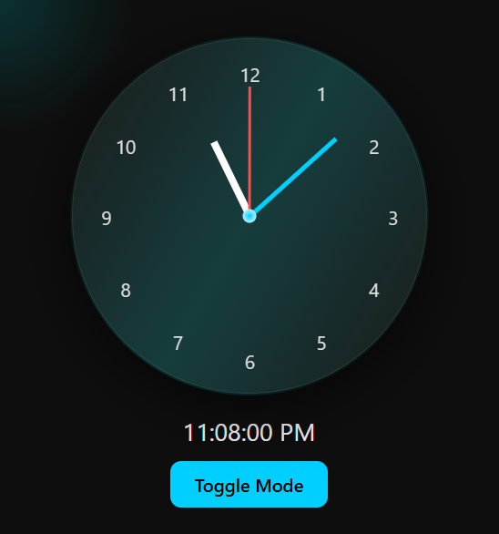
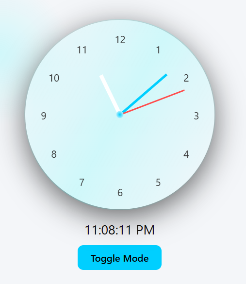

# ‚è∞ Premium Smooth Clock UI

A clean, modern, and smooth analog + digital clock built using **HTML, CSS, and JavaScript**.
Designed with a **minimal premium UI**, subtle animations, and interactive effects.

---

## ‚ú® Features

* ̵í Smooth second hand animation (no ticking)
* ̺ô Dark / Light mode toggle
* Ì≤° Cursor-follow glow effect
* ÌæØ Clean glassmorphism UI
* Ì≥± Fully responsive design
* Ì¥• Minimal neon accents (not overdesigned)
* ‚è± Digital time display (AM/PM format)

---

## Ì∂º Preview

<div align="center">




</div>

---

## Ì∫Ä How to Use

1. Download or copy the code
2. Save it as:

```
index.html
```

3. Open in browser

---

## Ì≥Å Project Structure

```
project-folder/
│
├── index.html
└── images/
    ├── clock-dark.png
    └── clock-light.png
```

---

## Ìæ® Customization

You can easily customize:

* Ìæ® Colors (CSS variables)
* ‚è± Clock size
* ̺ü Glow intensity
* Ì¥ò Button style

---

## Ì∑† Tech Used

* HTML5
* CSS3 (Flexbox + Glassmorphism)
* JavaScript (Animation + Time Logic)

---

## Ì≤° Author Note

This project is designed to be:

* Clean ‚ú®
* Professional Ì≤º
* Smooth ‚ö°
* Not overdesigned Ì∫´

Perfect for:

* Portfolio
* UI Practice
* YouTube Shorts

---

## ⭐ Tip

For best result:

* Use dark background
* Add high-quality preview images
* Keep UI minimal

---

## Ì≥å Future Ideas

* Weather integration ̺¶
* Multiple themes Ìæ®
* iOS style redesign Ì≥±
* Dashboard UI Ì≥ä

---

Ì¥• Made with focus on **clean premium UI without overdesign**

