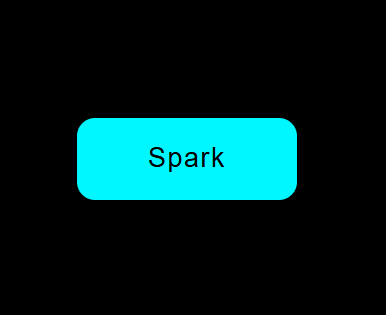
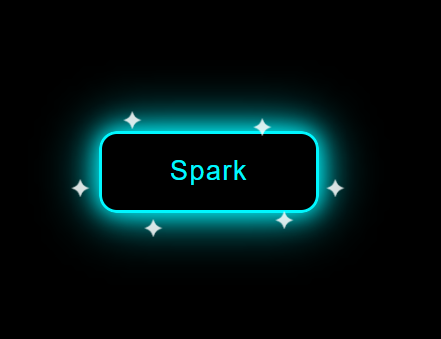

# ‚ú® Spark Button UI

A clean and premium **Spark Button** built using pure HTML & CSS.
Hover over the button to see glowing effects and sparkling animations ‚ú®

---

## Ì∫Ä Preview

  
  

---

## Ì≤° Features

* ‚ú® Smooth sparkle animation
* ̺ü Hover glow effect
* Ìæ® Clean modern UI
* ‚ö° Lightweight (no libraries)
* Ì≥± Fully responsive

---

## ̪†Ô∏è Built With

* HTML5
* CSS3

---

## ÌæØ How It Works

* Default state ‚Üí Colored button
* Hover state ‚Üí Transparent glow + spark effects
* Sparks appear outside the button and animate smoothly

---

## Ì≥Ç Usage

1. Download or copy the code
2. Open the file in your browser
3. Hover on the button and enjoy the effect ‚ú®

---

## Ìæ¨ Perfect For

* UI Design Inspiration
* Frontend Practice
* YouTube Shorts / Reels Content
* Portfolio Projects

---

## ⭐ Support

If you like this project, share it and use it in your projects Ì∫Ä

---

