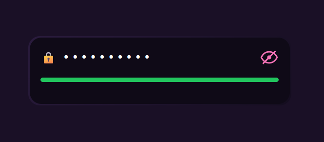
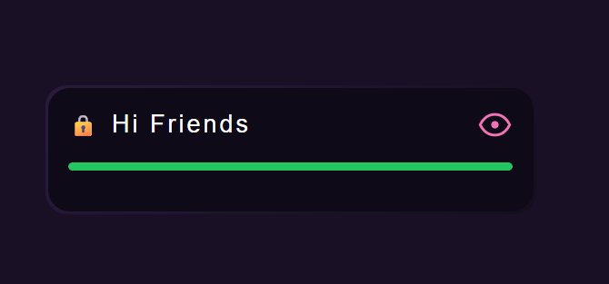

# Ì¥ê Premium Password Input UI

A modern, smooth, and visually satisfying password input field built using **HTML, CSS, and JavaScript**.

This UI combines clean design with interactive animations like **eye toggle, shine effect, and strength-based progress bar** — making it perfect for real-world apps and viral UI demos.

---

## ‚ú® Features

* ̱Š**Eye Toggle with Blink Animation**
* Ì¥í **Secure Password Hide/Show**
* ‚ú® **Directional Shine Effect (on click)**
* Ì≥ä **Live Password Strength Indicator**
* Ìæ® **Color-Based Progress Fill (Red ‚Üí Orange ‚Üí Green)**
* Ì≤é **Clean & Premium UI Design**
* ‚ö° **Smooth Animations & Transitions**

---

## Ì∂ºÔ∏è Preview

<p align="center">
  
  
</p>

---

## ÌæØ How It Works

* When typing password:

  * Weak ‚Üí Ì¥¥ Red bar
  * Medium ‚Üí Ìø† Orange bar
  * Strong ‚Üí Ìø¢ Green full bar

* Clicking the eye icon:

  * ̱ŠOpens password (left ‚Üí right shine)
  * Ìπà Hides password (right ‚Üí left shine)
  * ‚ú® Includes smooth blink animation

---

## Ì≥Å Project Structure

```
project/
│── index.html
│── images/
│   ├── preview1.png
│   └── preview2.png
```

---

## Ì∫Ä Usage

1. Download or copy the code
2. Open `index.html` in your browser
3. Start typing and enjoy the animation

---

## Ì≤° Design Philosophy

> "Less noise, more experience."

This UI focuses on:

* Minimal design
* Smooth feedback
* Clean interaction

Perfect for:

* Login forms
* UI demos
* Frontend projects
* YouTube Shorts / Reels content

---

## Ì¥• Highlights

* No external libraries
* Fully responsive
* Beginner-friendly code
* High visual impact

---

## Ì≥å Note

Make sure to place your preview images inside the `images` folder for proper display.

---

## ❤️ Support

If you like this design, use it in your projects and share it with others Ì∫Ä

---

