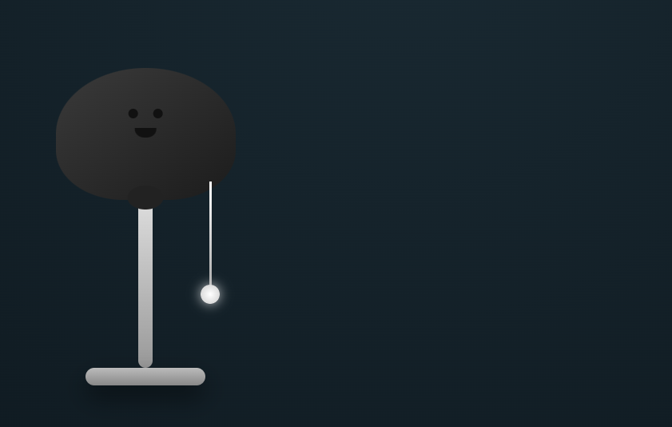
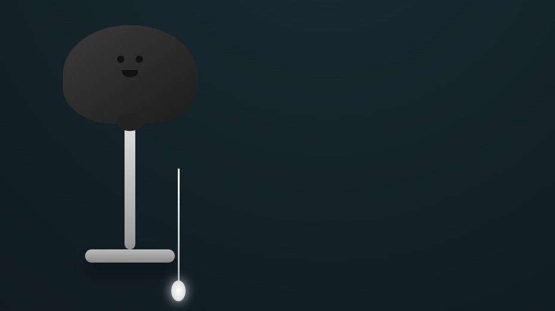
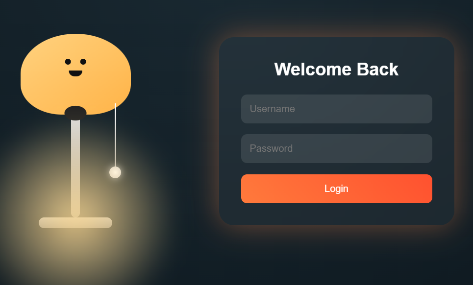

# Ì≤° Realistic Lamp Login UI

A creative and interactive login UI where a **lamp controls the entire experience**.
Pull the string to turn on the light and reveal the login form ‚ú®

---

## Ì∫Ä Preview

<p align="center">
  
  
</p>

---

## ÌæØ Features

‚ú® Realistic lamp design with shadows
‚ú® Pullable thread interaction
‚ú® Smooth light glow effect
‚ú® Animated login form reveal
‚ú® Clean glassmorphism UI
‚ú® Pure HTML + CSS + JavaScript

---

## ÌæÆ How It Works

* Grab the lamp string
* Pull it down
* Lamp turns ON Ì≤°
* Login form appears smoothly

---

## ̪†Ô∏è Tech Used

* HTML5
* CSS3 (Gradients + Shadows + Blur)
* Vanilla JavaScript

---

## Ì≥Ç Project Structure

```
index.html
```

---

## ‚ö° Customization

You can easily modify:

* Ìæ® Colors ‚Üí change gradients in CSS
* Ì≤° Light size ‚Üí edit `.light` width/height
* Ìæ≠ Animation speed ‚Üí adjust `transition`
* Ì∑µ String length ‚Üí edit `.string` height

---

## Ì≤é Highlights

* No libraries used
* Lightweight and fast
* Perfect for UI inspiration
* Unique interaction concept

---

## Ì≥∏ Screenshots

## Ì∫Ä Preview

<p align="center">
  
  
  
</p>

---

## Ì∑† Inspiration

Inspired by real-life pull-switch lamps and modern UI animations.

---

## ⭐ Support

If you like this project, give it a ‚≠ê and share it! Ì∫Ä

