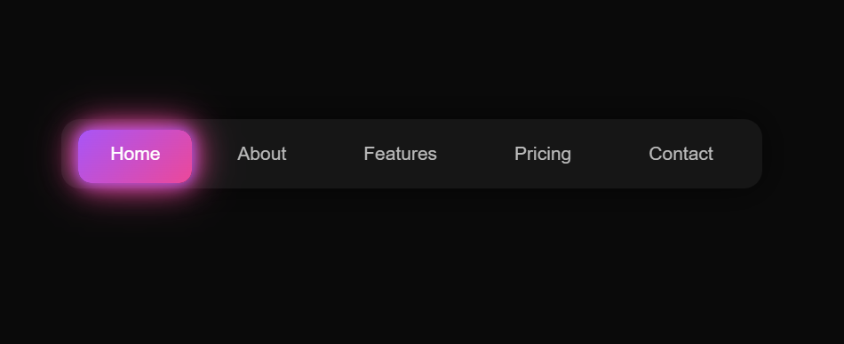
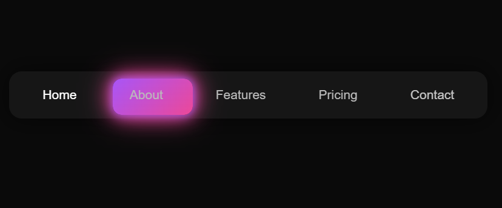

# ̺ü Premium Smooth Navbar

A modern and smooth animated navbar built using pure **HTML, CSS, and JavaScript**.  
It features a clean UI with glowing gradient effects and smooth sliding animation.

---

## Ì≥∏ Preview

  
  

---

## Ì∫Ä Features

- ‚ú® Smooth sliding highlight animation  
- Ìæ® Premium gradient color (Purple + Pink)  
- ̺ô Glassmorphism design  
- ‚ö° Fast and lightweight  
- Ì≥± Responsive layout  
- Ì∑ä Clean and modern UI  

---

## ̪†Ô∏è Technologies Used

- HTML5  
- CSS3  
- JavaScript (Vanilla)

---

## Ì≥Ç Sections

- Home  
- About  
- Features  
- Pricing  
- Contact  

---

## ÌæØ How It Works

- A sliding **highlight bar (slider)** moves smoothly when hovering or clicking on menu items  
- The active tab stays highlighted  
- CSS handles design and animations  
- JavaScript controls the slider movement  

---

## ▶️ How to Use

1. Copy the full code into an `.html` file  
2. Open the file in your browser  
3. Enjoy the smooth premium navbar  

---

## Ì≤° Customization

You can easily customize:

- Colors (gradient in `.slider`)
- Menu text (inside `<a>` tags)
- Font styles
- Animation speed (`transition`)

---

## Ì≥ú License

Free to use for personal and learning projects.
