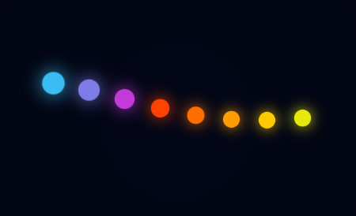
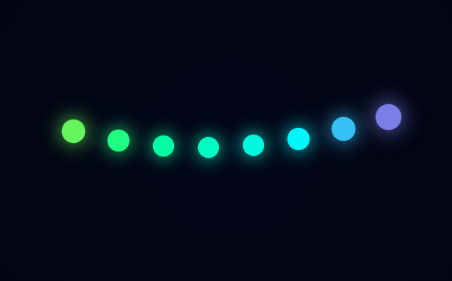
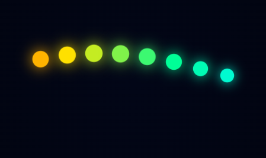

# í·¬ Color Shifting DNA Loader

A **modern, ultra-smooth DNA-style loading animation** built using pure HTML & CSS.
This loader features a **helix (DNA) motion combined with dynamic color shifting**, creating a visually stunning and premium UI experience.

---

## ✨ Preview

<p align="center">
  
  
  
</p>

---

## íº€ Features

* í·¬ **DNA Helix Animation** — Smooth wave creates realistic structure
* í¼ˆ **Color Shifting Effect** — Neon colors continuously change
* ⚡ **No Lag Performance** — Pure CSS animation (no JavaScript)
* í¾¨ **Premium UI Look** — Modern gradient + glow
* í³± **Responsive Design** — Works on all devices
* í´¥ **Shorts Ready Animation** — Perfect for reels & demos

---

## í³‚ Project Structure

```bash
project/
│── index.html
│── images/
│    ├── preview1.png
│    ├── preview2.png
│    └── preview3.png
```

---

## í» ï¸� Technologies Used

* HTML5
* CSS3 (Keyframes, Animations)

---

## í²¡ How It Works

* Each dot acts as a **DNA node**
* Delays create **helix illusion**
* Keyframes control:

  * Vertical wave motion
  * Scaling effect
  * Color transitions

---

## í¾¯ Use Cases

* Loading screens
* UI animations
* Portfolio projects
* YouTube Shorts / Reels
* Creative web design

---

## ⚙� Customization

You can easily modify:

* í¾¨ Colors in `@keyframes colorShift`
* �� Animation speed
* í´µ Dot size
* � Gap between dots

---

## í¼Ÿ Tips

* Use dark background for best glow ✨
* Add blur/glass effect for premium feel �
* Record this for viral short content íº€

---

## í³œ License

Free to use for personal and commercial projects.

---

## �� Support

If you like this project, share it and use it in your UI builds!

---

í´¥ *Premium Animation • Smooth Performance • Modern UI*

