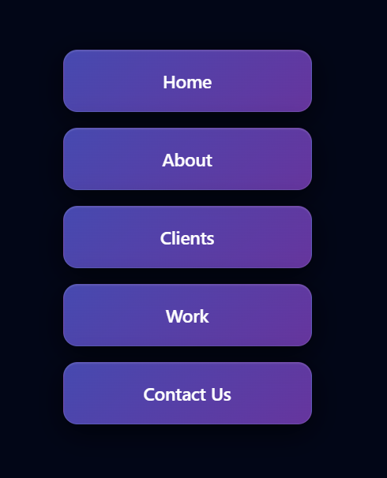
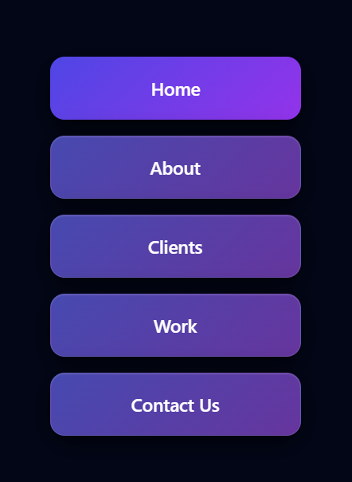

# � Premium Glass 3D Flip Menu

A modern and visually stunning **3D flip menu** built using pure HTML & CSS.
This UI uses **glassmorphism, neon gradients, and smooth 3D animation** to create a premium experience.

---

## ✨ Preview

<p align="center">
  
  
</p>

---

## íº€ Features

* í´„ Smooth 3D flip animation
* � Glassmorphism UI (blur + transparency)
* í¼ˆ Premium neon gradient colors
* ✨ Glow effect on hover
* í¾¯ Clean and modern layout
* âš¡ Pure HTML & CSS (no frameworks)

---

## í» ï¸� Tech Stack

* HTML5
* CSS3 (3D transforms, gradients, backdrop-filter)

---

## í³‚ Folder Structure

```
project/
│── index.html
│── README.md
│── images/
│    ├── preview1.png
│    └── preview2.png
```

---

## í¾¯ How It Works

* Each menu item has two sides:

  * Front face
  * Back face
* On hover:

  * The inner container rotates using `rotateY(180deg)`
* 3D effect is created using:

  * `perspective`
  * `transform-style: preserve-3d`
  * `backface-visibility`

---

## í¾¨ Design Highlights

* í¼Œ Dark SaaS-style background
* í·Š Glassmorphism blur effect
* ✨ Neon glow on hover
* í¾¥ Smooth cubic-bezier animation

---

## í³¸ Screenshots

<p align="center">
  
  
</p>

---

## í²¡ Use Cases

* Portfolio websites
* Landing pages
* SaaS dashboards
* UI inspiration projects
* YouTube Shorts / Reels demos

---

## í·  Learnings

* CSS 3D transforms
* Glassmorphism design
* Modern UI animations
* Hover interaction techniques

---

## íº€ Future Improvements

* í¾¯ Mouse-follow 3D tilt effect
* í¼ˆ Animated gradients
* í¾§ Hover sound effects
* í³± Mobile touch support

---

## â­� Final Thoughts

This is not just a menu —
it's a **premium UI animation** that can level up your frontend projects í´¥

