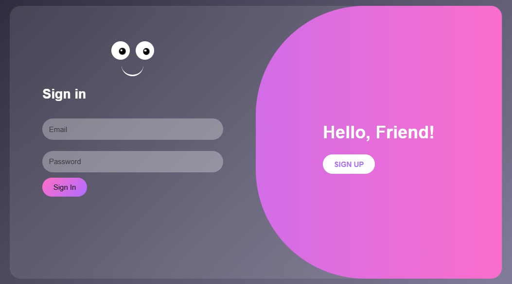
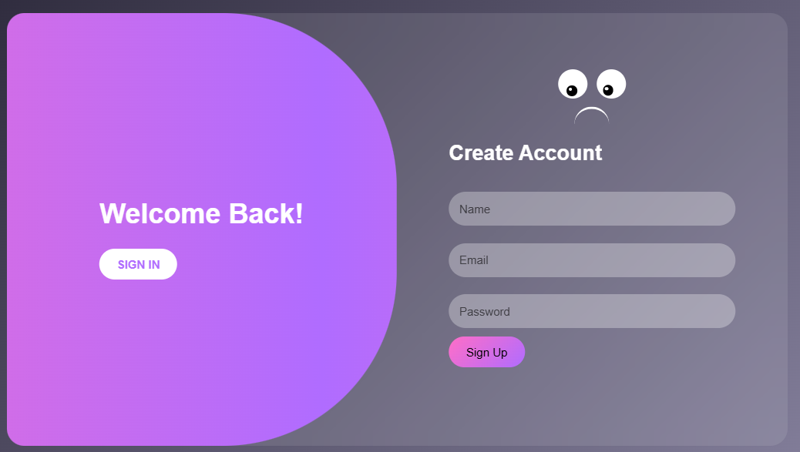

# Ì¥• Animated Login UI (Next-Level Eyes Interaction)

A **premium animated login & signup UI** built using **HTML, CSS, and JavaScript** featuring realistic eye tracking, blinking animation, and smooth panel transitions.

---

## ‚ú® Features

* Ì±Ä Realistic **eyes follow cursor**
* Ì∏â Smooth **natural blinking animation**
* ÌæØ Smart **form toggle (Sign In / Sign Up)**
* Ì∏ä Animated **face expression (smile)**
* Ì≤é Modern **glass UI design**
* ̺à Gradient animated overlay
* Ì∫Ä Smooth transitions

---

## Ì≥∏ Preview

  
  

---

## ̪†Ô∏è Tech Stack

* HTML5
* CSS3
* JavaScript

---

## ÌæÆ How It Works

* Eyes track cursor using math (angle calculation)
* Blink uses eyelid animation with random timing
* Forms switch using class toggle
* UI animations powered by CSS transitions

---

## Ì∫Ä How to Use

1. Save file as `index.html`
2. Open in browser

---

## Ì≤° Ideas for Improvement

* Add login validation
* Add success/error animation
* Make responsive
* Add backend integration

---

## ⭐ Why This Project?

* Clean UI
* Interactive animations
* Beginner friendly
* Perfect for portfolio & shorts

---

Ì¥• Creative UI Animation Project

