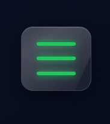
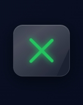

# Ì≤é Premium Glass Hamburger Menu Animation

A modern **Hamburger ‚Üí X toggle animation** with a **frosted glass UI**, smooth transitions, and neon glow effects.
Perfect for modern websites, dashboards, and mobile UI designs.

---

## ‚ú® Features

* Ì¥Ñ Smooth Hamburger to X transformation
* Ì∑ä Premium Glassmorphism UI (frosted glass effect)
* Ì≤° Neon glowing lines
* ‚ö° Ultra smooth CSS transitions
* Ì≥± Fully responsive & lightweight
* ÌæØ Clean and minimal design

---

## Ì∂ºÔ∏è Preview

<p align="center">
  
  
</p>

---

## Ì∫Ä How It Works

* Initially shows a **hamburger menu (‚ò∞)**
* On click:

  * Top & bottom lines rotate to form ‚ùå
  * Middle line disappears smoothly
* Uses pure **HTML + CSS + JavaScript**

---

## Ì≥Å Project Structure

```
project/
│── index.html
│── images/
│    ├── menu.png
│    └── close.png
```

---

## ̪†Ô∏è Technologies Used

* HTML5
* CSS3 (Glassmorphism + Animations)
* JavaScript (Event Handling)

---

## Ìæ® UI Highlights

* Frosted glass background using `backdrop-filter`
* Soft shadows for depth
* Neon glow effect using `box-shadow`
* Smooth rotation and scaling animations

---

## Ì≥å Use Cases

* Navigation menus
* Mobile UI toggles
* Admin dashboards
* Landing pages
* Modern web apps

---

## ‚ö° Customization

You can easily customize:

* Ìæ® Colors (change neon glow)
* Ì≥è Size of the button
* Ì≤® Animation speed
* ̺à Background gradients

---

## Ìπå Author

Made with ❤️ for creative developers

---

## ⭐ Support

If you like this project, give it a ‚≠ê and share it Ì∫Ä

