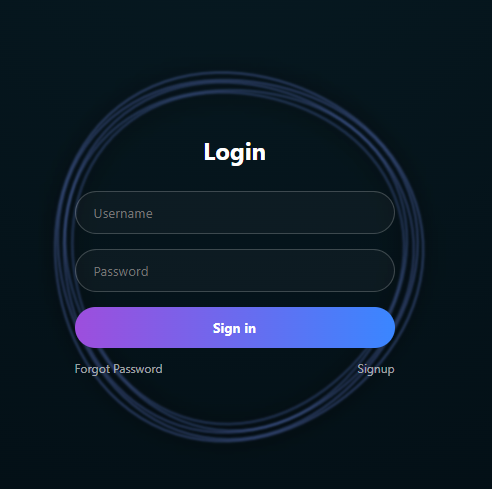
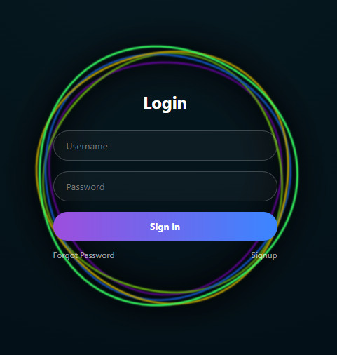

# ̺à Premium Rainbow Login UI

A modern and interactive **login page UI** built using **HTML, CSS, and JavaScript**, featuring smooth animated circular waves and a **rainbow glow effect on hover**.

---

## ‚ú® Features

* Ì¥µ Clean and minimal login UI (no card design)
* ÌºÄ 5 layered animated circular waves
* ̺à Rainbow glow effect on hover (interactive)
* ‚ú® Smooth animation with premium feel
* Ì≤° Strong neon glow effect
* ‚ö° Lightweight (pure HTML, CSS, JS)

---

## Ì≥∏ Preview

<p align="center">
  
  
</p>

---

## Ì∫Ä How It Works

* The background uses animated SVG paths to create fluid circular motion
* Each circle has:

  * Different radius
  * Different speed
  * Slight distortion for organic animation
* On hover:

  * Colors switch to dynamic rainbow gradient
  * Glow intensity increases for premium effect

---

## ̪†Ô∏è Technologies Used

* HTML5
* CSS3 (Glow + Animation Effects)
* JavaScript (Custom Animation Logic)

---

## Ì≥Ç Folder Structure

```
project/
│
├── index.html
├── README.md
└── images/
    ├── preview1.png
    └── preview2.png
```

---

## ÌæØ Usage

1. Copy or download the project
2. Open `index.html` in your browser
3. Hover on the login form to see the ̺à rainbow glow effect

---

## Ì≤é Highlights

* No external libraries
* Fully centered responsive layout
* Premium UI animation
* Perfect for:

  * Portfolio projects
  * UI showcases
  * YouTube Shorts

---

## Ì¥• Future Improvements

* Cursor-follow glow effect
* Click burst animation
* Glass morph UI upgrade
* Dark/Light mode

---

## ̱®‚ÄçÌ≤ª Author

Made with ❤️ for modern UI lovers

