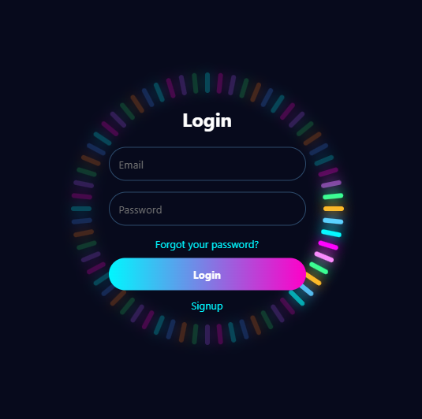

# ̺à Neon Circular Login UI

A modern **multi-color animated circular login UI** built using HTML, CSS, and JavaScript.
This design features a glowing rotating ring with smooth animation and a perfectly centered login form.

---

## ‚ú® Features

* ÌæØ Perfect center aligned login form
* ̺à Multi-color circular animation
* Ì¥• Smooth rotating glow effect
* Ì≤° Clear active vs inactive light contrast
* Ìæ® Modern neon UI design
* ‚ö° Lightweight (no libraries)

---

## Ì≥∏ Preview

<p align="center">
  
</p>

---

## ̪†Ô∏è Tech Stack

* HTML5
* CSS3
* JavaScript (Vanilla)

---

## Ì∫Ä How It Works

* Circular bars are generated dynamically using JavaScript
* Each bar is evenly placed using `rotate()` + `translateY()`
* A moving active segment creates the rotating animation
* Multi-colors are applied to give a neon effect

---

## Ìæ® Customization

You can easily customize:

* Colors ‚Üí Modify the `colors[]` array in JS
* Speed ‚Üí Adjust `setInterval()` timing
* Circle size ‚Üí Change `translateY()` value
* Glow ‚Üí Edit `box-shadow`

---

## Ì≥Ç Folder Structure

```
project/
│── index.html
│── images/
│     └── preview.png
```

---

## ▶️ Usage

1. Download or copy the code
2. Place your preview image inside `images/preview.png`
3. Open `index.html` in browser
4. Enjoy the animation Ì∫Ä

---

## Ì≤° Use Cases

* Login pages
* UI animation showcases
* Portfolio projects
* Frontend practice

---

## ⭐ Tip

Works best on **dark backgrounds** for maximum neon effect.

