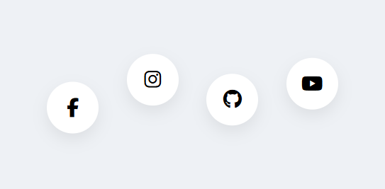
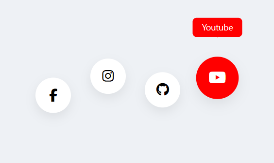

# Ì∫Ä Unique Social Media Hover UI

A clean and modern **Social Media Hover Animation UI** built using **HTML & CSS**.
This design features smooth hover effects, floating layout, and colorful tooltips.

---

## ‚ú® Features

* ÌæØ Unique zig-zag layout (not common UI)
* Ì¥• Smooth hover animation
* Ì≤¨ Tooltip with arrow
* Ìæ® Brand color transitions
* ‚ö° Lightweight & fast
* Ì≥± Fully customizable

---

## Ì∂ºÔ∏è Preview

| Default View              | Hover Effect               |
| ------------------------- | -------------------------- |
|  |  |

---

## ̪†Ô∏è Technologies Used

* HTML5
* CSS3
* Font Awesome Icons

---

## Ì≥Ç Folder Structure

```
project/
│── index.html
│── images/
│   ├── default.png
│   └── hover.png
```

---

## ⚙️ How to Use

1. Download or copy the code
2. Add your images inside `images` folder
3. Open `index.html` in browser

---

## Ìæ® Customization

You can easily change:

* Colors (in CSS hover classes)
* Icons (Font Awesome classes)
* Tooltip text
* Button size & spacing

---

## Ì≤° UI Highlights

* Floating button arrangement for unique look
* Smooth scale + lift animation
* Clean shadow for premium feel
* Simple yet eye-catching design

---

## Ì≥å Notes

* No JavaScript required
* Works in all modern browsers
* Easy to integrate into any project

---

## ❤️ Support

If you like this UI, use it in your projects and customize it further Ì∫Ä

