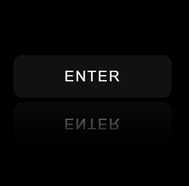
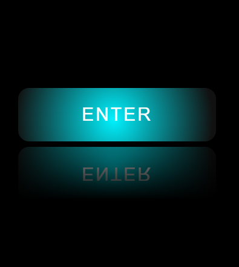

# ✨ Cursor Glow Button with Mirror Reflection

A premium UI button built using **HTML, CSS, and JavaScript** featuring a **cursor-follow glow effect** and a **realistic mirror reflection** — just like modern UI animations í´¥

---

## í³¸ Preview

<p align="center">
  
  
</p>

---

## íº€ Features

* í¾¯ Cursor-based glow effect
* í²¡ Smooth hover animation
* � Real mirror reflection (with text)
* âš¡ Lightweight & responsive
* í¾¨ Easy to customize colors

---

## í» ï¸� Tech Stack

* HTML5
* CSS3
* JavaScript (Vanilla)

---

## í³‚ Project Structure

```
project-folder/
│
├── index.html
└── images/
    ├── preview1.png
    └── preview2.png
```

---

## í¾¨ Customization

You can easily change the glow color:

```css
background: radial-gradient(circle, #00f2ff, transparent 70%);
```

Try different colors:

* í´µ Blue → `#00f2ff`
* í¿£ Purple → `#a855f7`
* í¿¢ Green → `#00ff88`

---

## ⚠� Note

* Mirror reflection uses `-webkit-box-reflect`
* Works best in **Chrome, Edge, Safari**
* Firefox may not support reflection

---

## í²¡ Use Cases

* Landing pages
* UI components
* Portfolio websites
* YouTube Shorts demos

---

## â­� Final Output

Clean, modern, and **eye-catching button animation** perfect for making your UI stand out íº€

---

