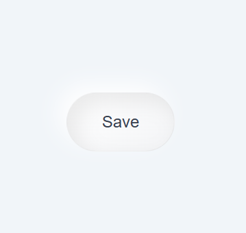
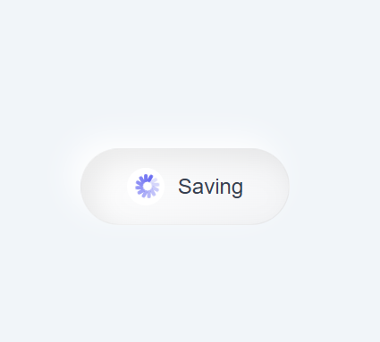
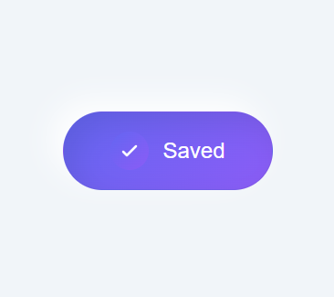

# ✨ Premium Save Button Animation

A clean and modern **Save → Saving → Saved** button built using **HTML, CSS, and JavaScript**.
Designed with smooth transitions and a premium UI feel.

---

## í³¸ Preview

<p align="center">
  
  
  
</p>

---

## íº€ Features

* Smooth state transitions (Save → Saving → Saved)
* Mac-style loading animation
* SVG check icon for crisp UI
* Soft neumorphism-inspired design
* Lightweight and fast
* No external libraries required

---

## í¾¯ How It Works

1. **Default State**

   * Displays **Save**
   * No icon visible

2. **Saving State**

   * Loader animation appears
   * Text changes to **Saving**

3. **Saved State**

   * Loader replaced with check icon
   * Text changes to **Saved**

4. **Reset**

   * Button returns to initial state automatically

---

## í» ï¸� Technologies Used

* HTML5
* CSS3 (Animations & Transitions)
* JavaScript

---

## � Project Structure

```id="f82k1a"
project/
│── index.html
│── images/
│    ├── save.png
│    ├── saving.png
│    └── saved.png
```

---

## âš¡ Usage

1. Copy the code into `index.html`
2. Add your images inside the `images/` folder
3. Open in browser
4. Click the button to see animation

---

## í¾¨ Customization

You can easily modify:

* Colors & gradients
* Animation timing
* Button size
* Text labels

---

## í³Œ Notes

* Works in all modern browsers
* Fully responsive
* Easy to integrate into any project

---

## �� Credits

Created for modern UI animation practice and portfolio showcase.

