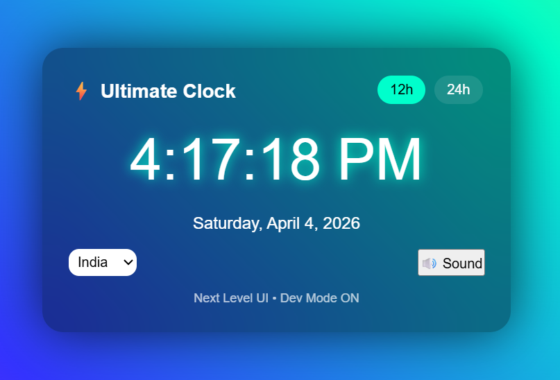
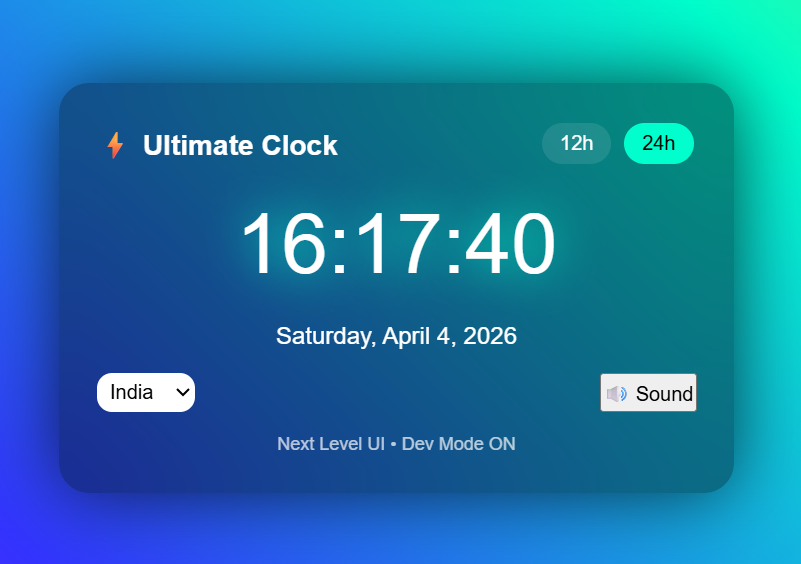

# âš¡ Ultimate Clock UI

A modern and premium **Digital Clock UI** built using **HTML, CSS, and JavaScript** with smooth animations and a futuristic glass design.

---

## í³¸ Preview

<p align="center">
  
  
</p>

---

## í¶¼ï¸� Images Setup

Create a folder named **images** and add:

* `12-hour.png` → Clock in **12-hour format (AM/PM visible)**
* `24-hour.png` → Clock in **24-hour format**

� Structure:

```
project-folder/
│── index.html
│── README.md
└── images/
    ├── 12-hour.png
    └── 24-hour.png
```

---

## íº€ Features

* � Real-time digital clock
* í´„ 12h / 24h toggle
* � Timezone selector
* í¾µ Sound ON / OFF
* í¼ˆ Animated gradient background
* í·Š Glassmorphism UI
* âš¡ Smooth glow animation

---

## í» ï¸� Tech Stack

* HTML5
* CSS3 (Animations + Glass UI)
* JavaScript

---

## � How to Use

1. Create `index.html`
2. Paste the code
3. Open in browser

---

## í¾¯ Customization

* í¾¨ Change colors in CSS
* � Add more timezones
* í´Š Modify sound
* í²¡ Adjust animations

---

## â­� Output

A clean and futuristic **clock UI** perfect for:

* Portfolio projects
* YouTube Shorts
* Frontend practice

---

í´¥ Simple • Clean • Premium UI

